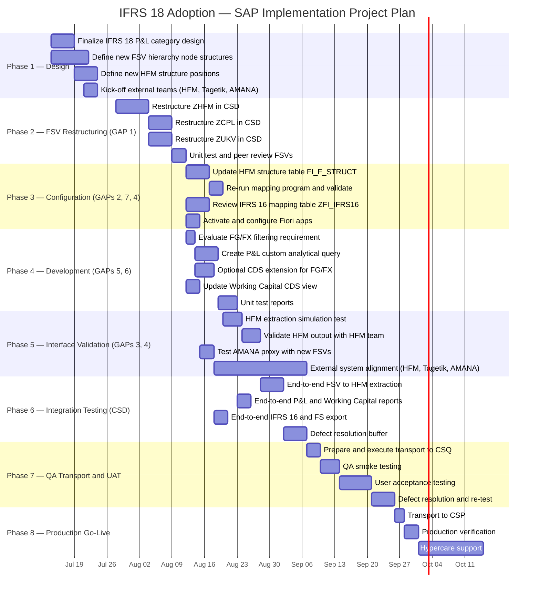

# IFRS 18 Adoption — SAP Implementation Project Plan

Project plan for the IFRS 18 SAP adoption, broken down by phase, activity,
effort, and timeline. Target: production readiness before **January 1,
2027** (IFRS 18 effective date). Plan baseline date: **July 9, 2026**
(~25 weeks of runway); the plan below spans ~22 weeks, leaving buffer
before the effective date.

See [`IFRS18-Fit-Gap-Analysis.md`](IFRS18-Fit-Gap-Analysis.md) for the
underlying GAP definitions this plan implements, and
[`IFRS18_Adoption_Project_Plan.xlsx`](IFRS18_Adoption_Project_Plan.xlsx)
for the editable/trackable version of this plan (now including the same
Execution Order and SAP Transaction/Object columns described below).

Every activity below states the exact SAP transaction code(s) and/or
development object(s) to touch, and an **Execution Order** number so the
plan can be picked up and executed directly, respecting dependencies —
see [Recommended Execution Sequence](#recommended-execution-sequence).

## Visual Timeline (Gantt)

## Recommended Execution Sequence

This is the **single, strictly ordered execution sequence** to follow if
several activities cannot be worked in parallel (e.g. one consultant
doing everything). Activities on the same row have no dependency on each
other and **can be executed in parallel** by different people once their
listed prerequisite is done — everything else must wait its turn.

| Exec. Order | Activity ID(s) — can run in parallel | Prerequisite (Exec. Order) |
|---|---|---|
| 1 | 1.1 | – (start here) |
| 2 | 1.2 | 1 |
| 3 | 1.3, 1.4, 1.5, 1.6 | 1 |
| 4 | 2.1 | 2, 3 |
| 5 | 2.2, 2.3 | 4 |
| 6 | 2.4 | 5 |
| 7 | 2.5 | 6 |
| 8 | 3.1, 3.4, 3.6, 4.1, 4.4 | 7 |
| 9 | 3.2, 4.2, 4.3 | 8 |
| 10 | 3.3, 3.5, 3.7, 4.5, 4.6 | 9 |
| 11 | 5.1, 5.3, 4.7, 4.8 | 10 |
| 12 | 5.2, 5.4 | 11 |
| 13 | 5.5, 5.6, 5.7 | 3 *(runs in the background throughout Phases 2–5)* |
| 14 | 6.1 | 12 |
| 15 | 6.2, 6.3, 6.4, 6.5, 6.6 | 11, 12 |
| 16 | 6.7 | 14 |
| 17 | 6.8 | 14, 15, 16 |
| 18 | 7.1 | 17 |
| 19 | 7.2 | 18 |
| 20 | 7.3 | 19 |
| 21 | 7.4 | 20 |
| 22 | 7.5 | 21 |
| 23 | 7.6 | 22 |
| 24 | 8.1 | 23 |
| 25 | 8.2, 8.3 | 24 |
| 26 | 8.4 | 25 |

**How to use this table:** find the lowest execution order number for
which you have people/time available, complete every activity in that
row, then move to the next row. GAP 1 (Exec. Order 1–7) is the
foundation everything else builds on — do not start Exec. Order 8+ until
Exec. Order 7 (peer review of the restructured FSVs) is signed off.

## Detailed Activity Breakdown

Each activity below lists the exact SAP transaction code(s) and/or
development object(s) (tables, programs, CDS views, function modules)
that need to be touched, so it can be picked up and executed directly —
no separate technical design step required. "Exec." refers to the
Execution Order above.

### Phase 1 — Design & Preparation (Jul 14 – Jul 25 | 2 weeks)

| # | Exec. | Activity | SAP Transaction(s) / Object(s) | Role | Effort (PD) |
|---|---|---|---|---|---|
| 1.1 | 1 | Finalize IFRS 18 P&L category design with group accounting team (Operating / Investing / Financing boundaries, subtotal definitions) | Workshop — no transaction; output is a signed-off category definition document | FC + Accounting | 3 |
| 1.2 | 2 | Define new FSV hierarchy node structure for ZHFM, ZCPL, ZUKV (node IDs, parent-child relationships, G/L account assignments) | Design doc for later use in **OB58** (Financial Statement Version: Maintain) | FC | 5 |
| 1.3 | 3 | Define new HFM structure positions and attribute flags (consolidation method, functional area, intercompany, movement type, region, sign reversal) | Design doc for later use in **SM30** on table `/FIT/FI_F_STRUCT` | FC | 3 |
| 1.4 | 3 | Kick-off coordination with HFM team (new structure positions, receiving format) | Meeting — no transaction | FC + HFM | 1 |
| 1.5 | 3 | Kick-off coordination with Tagetik team (account code alignment) | Meeting — no transaction | FC + Tagetik | 1 |
| 1.6 | 3 | Kick-off coordination with AMANA team (new category handling) | Meeting — no transaction | FC + AMANA | 0.5 |
| | | **Phase 1 Subtotal** | | | **13.5** |

### Phase 2 — FSV Restructuring in CSD (Jul 28 – Aug 15 | 3 weeks)

| # | Exec. | Activity | SAP Transaction(s) / Object(s) | Role | Effort (PD) |
|---|---|---|---|---|---|
| 2.1 | 4 | Restructure ZHFM via OB58: add Operating/Investing/Financing nodes, two subtotal nodes, reassign P&L G/L accounts | **OB58** (FSV = `ZHFM`, chart of accounts `ZFRE`) | FC | 5 |
| 2.2 | 5 | Restructure ZCPL via OB58: apply IFRS 18 structure for controlling P&L | **OB58** (FSV = `ZCPL`) | FC | 3 |
| 2.3 | 5 | Restructure ZUKV via OB58: apply IFRS 18 categories preserving cost-of-sales classification | **OB58** (FSV = `ZUKV`) | FC | 3 |
| 2.4 | 6 | Unit test each FSV using standard financial statement reports | **F.01** / **RFBILA00** (or **S_ALR_87012284**), run once per FSV (`ZHFM`, `ZCPL`, `ZUKV`) | FC | 2 |
| 2.5 | 7 | Peer review of FSV structures with group accounting — **sign-off gate before Phase 3/4 can start** | Review of **OB58** output; meeting sign-off | FC + Accounting | 1 |
| | | **Phase 2 Subtotal** | | | **14** |

### Phase 3 — Configuration Updates (Aug 18 – Aug 29 | 2 weeks, parallel tracks)

| # | Exec. | Activity | SAP Transaction(s) / Object(s) | Role | Effort (PD) |
|---|---|---|---|---|---|
| 3.1 | 8 | Update `/FIT/FI_F_STRUCT` table entries — add new IFRS 18 P&L structure positions with attribute flags | **SM30** on table `/FIT/FI_F_STRUCT` (new position codes in the `21xxxx` range; set `KNSAA-D`, `KZFKB`/`KZFKCHNG`, `KZVBUND`, `KZRMVCT`, `KZREGION`, `KZVZUMK`) | FC | 3 |
| 3.2 | 9 | Re-execute mapping program with delete-and-regenerate | **ZHFMB0** (program `/FIT/FI_D_HFM_BIL_ZUORD_001`); parameters: FSV = updated `ZHFM`, accounting principle = `GRUP`, chart of accounts = `ZFRE`, delete flag = `X` | FC | 0.5 |
| 3.3 | 10 | Validate regenerated `/FIT/FI_F_HKONT` mapping — verify all P&L accounts map to correct new positions, BS mappings intact | **SE16N** (display table `/FIT/FI_F_HKONT`) | FC | 2 |
| 3.4 | 8 | Review all 510 entries in `ZFI_IFRS16` mapping table — verify G/L accounts for depreciation (670xxx → Operating) and interest (661xxx → Financing) are correctly classified in the restructured FSVs | **ZFI_IFRS16_MAPPING** (or **SM30**) on table `ZFI_IFRS16` | FC | 2 |
| 3.5 | 10 | Update `ZFI_IFRS16` entries if chart of accounts changes or Tagetik introduces new codes | **ZFI_IFRS16_MAPPING** / **SM30** on table `ZFI_IFRS16` (field `HKONT` / `TAGETIC_ACCOUNT`) | FC | 1 |
| 3.6 | 8 | Activate Fiori apps F0708 and W0161 in Fiori Launchpad | **/UI2/FLPD_CUST** (Fiori Launchpad Designer) — activate app IDs **F0708** and **W0161** | Basis/FC | 1 |
| 3.7 | 10 | Configure Fiori apps for IFRS FSVs (ZHFM, ZCPL, ZUKV) | App-specific configuration of **F0708** / **W0161** — bind default FSV parameters to `ZHFM`, `ZCPL`, `ZUKV` | FC | 1 |
| | | **Phase 3 Subtotal** | | | **10.5** |

### Phase 4 — Development (Aug 18 – Sep 5 | 3 weeks, parallel with Phase 3)

| # | Exec. | Activity | SAP Transaction(s) / Object(s) | Role | Effort (PD) |
|---|---|---|---|---|---|
| 4.1 | 8 | Evaluate whether FG/FX document type exclusion is still a business requirement | Business decision workshop — no transaction | FC + Dev | 1 |
| 4.2 | 9 | Create custom analytical query on `I_JournalEntryItemCube` (P&L filter + functional area classification) | **Custom Analytical Queries** app (Fiori "Custom CDS Views and Analytical Queries") on CDS view `I_JournalEntryItemCube`; filters `IsProfitLossAccount = 'X'`, `FunctionalArea` not initial | FC/Dev | 3 |
| 4.3 | 9 | *Optional:* Create CDS view extension on `I_JournalEntryItemCube` for FG/FX filtering (if required) | ADT/Eclipse — DDLS extend view on `I_JournalEntryItemCube`; transport via **SE09**/**SE10** | Dev | 2 |
| 4.4 | 8 | Update `ZI_GLAcctBalanceCube` CASE WHEN statement — replace hardcoded ZHFM hierarchy node IDs with new node IDs from restructured hierarchy | ADT/Eclipse — edit CDS view `ZI_GLAcctBalanceCube` source (association to `I_GLAccountHierarchyNode`, `GLAccountHierarchy = 'ZHFM'`); transport via **SE09**/**SE10** | Dev | 1 |
| 4.5 | 10 | Verify `ZC_WORKINGCAPITAL_Q001` downstream — confirm hierarchy filter binding still valid | ADT/Eclipse or **RSRT** — check query `ZC_WORKINGCAPITAL_Q001` filter binding `{type: #CONSTANT, value: 'ZHFM'}` | Dev | 0.5 |
| 4.6 | 10 | Evaluate SAC prototype views (`ZP_WORKINGCAPITAL_ITEM` etc.) for retirement | SAP Analytics Cloud review — no ABAP transaction | Dev | 0.5 |
| 4.7 | 11 | Unit test new P&L analytical query — compare output with `ZC_PROFITANDLOSS_UKV` for reference period | Run new query + `ZC_PROFITANDLOSS_UKV` side-by-side via Fiori / Analysis for Office | FC | 2 |
| 4.8 | 11 | Unit test working capital report — validate all 5 categories produce correct balances | Run working-capital report (Fiori app consuming `ZC_WORKINGCAPITAL_Q001`) | FC | 1 |
| | | **Phase 4 Subtotal** | | | **11** |

### Phase 5 — Interface Validation (Sep 1 – Sep 19 | 3 weeks)

| # | Exec. | Activity | SAP Transaction(s) / Object(s) | Role | Effort (PD) |
|---|---|---|---|---|---|
| 5.1 | 11 | Run HFM extraction in simulation mode | **ZHFM01** (program `/FIT/FI_D_HFM_INTF_001`); parameter `PX_SIMUL = 'X'` | FC | 1 |
| 5.2 | 12 | Validate HFM output file format against HFM expected input — verify new structure positions appear correctly in aggregation pipeline (INTF1→4) | **ZHFM10** (program `/FIT/FI_D_HFM_INTF_010`); review output file via **AL11** or application server directory | FC + HFM | 2 |
| 5.3 | 11 | Verify `/FIT/FI_F_KONSM` and `/FIT/FI_F_RMVCT` entries are correct for new positions | **SM30** on tables `/FIT/FI_F_KONSM` and `/FIT/FI_F_RMVCT` | FC | 1 |
| 5.4 | 12 | Test AMANA proxy parsing with restructured FSV output — verify positional parsing still works | **ZFI_RFBILA00_DOWN** (AMANA export path, program `ZFI_R_RFBILA00_DOWN`); test function module `ZFI_AMANA_PROXY` via **SE37**; check logs in **SLG1** | FC | 1 |
| 5.5 | 13 | Coordinate HFM-side configuration updates (new accounts/categories in HFM) | External system (Oracle HFM) — no SAP transaction | HFM team | 3 |
| 5.6 | 13 | Coordinate Tagetik account code alignment | External system (Tagetik) — no SAP transaction | Tagetik team | 2 |
| 5.7 | 13 | Coordinate AMANA receiving system updates | External system (AMANA DMS) — no SAP transaction | AMANA team | 1 |
| | | **Phase 5 Subtotal** | | | **11** |

### Phase 6 — Integration Testing in CSD (Sep 15 – Oct 10 | 3.5 weeks)

| # | Exec. | Activity | SAP Transaction(s) / Object(s) | Role | Effort (PD) |
|---|---|---|---|---|---|
| 6.1 | 14 | End-to-end: FSV → mapping regeneration → HFM extraction → file validation | Re-run full chain: **ZHFMB0** → **ZHFM01** → **ZHFM10**; review final output file | FC | 3 |
| 6.2 | 15 | End-to-end: FSV → P&L report with IFRS 18 categories and subtotals | Run custom analytical query from 4.2 via Fiori/Analysis for Office | FC | 1 |
| 6.3 | 15 | End-to-end: FSV → working capital report with updated hierarchy nodes | Run working-capital report (`ZC_WORKINGCAPITAL_Q001`) | FC | 1 |
| 6.4 | 15 | End-to-end: IFRS 16 lease posting → verify FSV classification (depreciation = Operating, interest = Financing) | Test run of **Z_FI_I_LOAD_IFRS16**, then check classification via **F.01**/**RFBILA00** | FC | 1 |
| 6.5 | 15 | End-to-end: Financial statement export → AMANA transfer | Full run of **ZFI_RFBILA00_DOWN** with AMANA export option | FC | 1 |
| 6.6 | 15 | Regression test: Shareholder reporting (FIT — no changes expected) | Run existing shareholder reports unchanged | FC | 0.5 |
| 6.7 | 16 | Compare pre-IFRS 18 (XHFM/XCPL/XUKV) vs. post-IFRS 18 output for audit trail | **OB58** (compare `XHFM`/`XCPL`/`XUKV` vs. `ZHFM`/`ZCPL`/`ZUKV`) + **F.01** report comparison | FC | 2 |
| 6.8 | 17 | Defect resolution buffer | Fixes applied to the specific transaction/object where the defect was found | FC + Dev | 3 |
| | | **Phase 6 Subtotal** | | | **12.5** |

### Phase 7 — QA Transport & UAT (Oct 13 – Nov 7 | 4 weeks)

| # | Exec. | Activity | SAP Transaction(s) / Object(s) | Role | Effort (PD) |
|---|---|---|---|---|---|
| 7.1 | 18 | Prepare transport requests (config + workbench) | **SE09** / **SE10** (Transport Organizer) — one customizing request (OB58/SM30 changes) + one workbench request (CDS/ABAP changes) | Dev/Basis | 1 |
| 7.2 | 19 | Execute transport CSD → CSQ | **STMS** (Transport Management System) | Basis | 0.5 |
| 7.3 | 20 | QA smoke testing — verify all 7 capabilities in CSQ | Re-run key transactions in CSQ: **OB58**, **ZHFMB0**, **ZHFM01**, **ZHFM10**, **F0708**/**W0161**, custom analytical query, **Z_FI_I_LOAD_IFRS16**, **ZFI_RFBILA00_DOWN** | FC | 3 |
| 7.4 | 21 | User acceptance testing with business users (finance, controlling, consolidation) | Business users execute Fiori apps/reports listed above in CSQ | Business + FC | 5 |
| 7.5 | 22 | Defect resolution and re-transport | Fixes in source object + **SE09**/**SE10**/**STMS** re-transport | FC + Dev | 3 |
| 7.6 | 23 | Re-test after fixes | Same transactions as 7.3 | FC | 2 |
| | | **Phase 7 Subtotal** | | | **14.5** |

### Phase 8 — Production Go-Live (Nov 10 – Dec 5 | 4 weeks incl. hypercare)

| # | Exec. | Activity | SAP Transaction(s) / Object(s) | Role | Effort (PD) |
|---|---|---|---|---|---|
| 8.1 | 24 | Execute transport CSQ → CSP | **STMS** | Basis | 0.5 |
| 8.2 | 25 | Production verification — run each capability and validate output | Same transactions as 7.3, executed in CSP | FC | 2 |
| 8.3 | 25 | Go-live communication to business users | Email/meeting — no transaction | PM | 0.5 |
| 8.4 | 26 | Hypercare support (2 weeks — monitor HFM extraction, reports, IFRS 16 postings) | **SM37** (monitor background jobs for **ZHFM01**/**ZHFM10**/**Z_FI_I_LOAD_IFRS16**), **SLG1** (application log), **ST22** (dumps) | FC + Dev | 5 |
| | | **Phase 8 Subtotal** | | | **8** |

Note: Phases 3 and 4 run in parallel, and Phase 5 overlaps with the tail
end of Phase 4, so the calendar duration is shorter than the sum of
individual phase durations. See the **Recommended Execution Sequence**
table above if activities must be done one at a time by a single team.

## Effort Summary

### By Phase

| Phase | Duration | Effort (PD) |
|---|---|---|
| 1. Design & Preparation | 2 weeks | 13.5 |
| 2. FSV Restructuring | 3 weeks | 14.0 |
| 3. Configuration Updates | 2 weeks | 10.5 |
| 4. Development | 3 weeks | 11.0 |
| 5. Interface Validation | 3 weeks | 11.0 |
| 6. Integration Testing | 3.5 weeks | 12.5 |
| 7. QA Transport & UAT | 4 weeks | 14.5 |
| 8. Production Go-Live | 4 weeks | 8.0 |
| **Total** | **~22 weeks** | **~95 person-days** |

### By Role

| Role | Effort (PD) | % of Total |
|---|---|---|
| FI/CO Functional Consultant | 65 | 68% |
| ABAP Developer | 12 | 13% |
| Business Users (UAT) | 5 | 5% |
| Project Manager | 5 | 5% |
| External Teams (HFM, Tagetik, AMANA) | 6 | 6% |
| SAP Basis Administrator | 3 | 3% |
| **Total** | **~96** | **100%** |

### By GAP

| GAP | Type | Effort (PD) | Notes |
|---|---|---|---|
| 1. IFRS Financial Statement Structure Definition | CONFIG | 19 | Largest single item — 3 FSVs to restructure |
| 2. G/L Account to Consolidation Structure Mapping | CONFIG | 9 | Table updates + mapping regeneration |
| 3. Financial Data Extraction for Group Consolidation | INTERFACE + CONFIG | 10 | Includes HFM-side coordination |
| 4. Financial Statement Data Export | INTERFACE | 7 | Fiori activation + AMANA testing |
| 5. Income Statement Reporting (Cost of Sales) | REPORT | 9 | New analytical query + optional CDS extension |
| 6. Working Capital Balance Sheet Reporting | ENHANCEMENT | 5 | CDS view node ID update |
| 7. IFRS 16 Lease Accounting Data Loading | CONFIG | 6 | Mapping table review + Tagetik coordination |
| Cross-cutting (PM, defect resolution, transports, UAT, hypercare) | — | 30 | Shared across all GAPs |
| **Total** | | **~95** | |

### By Work Type

| Category | Effort (PD) | % of Total |
|---|---|---|
| Configuration / Customizing (OB58, SM30, table maintenance) | 30 | 32% |
| Development (CDS views, analytical queries) | 8 | 8% |
| Testing (unit, integration, QA, UAT) | 27 | 28% |
| External Coordination (HFM, Tagetik, AMANA) | 8 | 8% |
| Project Management & Go-Live | 14 | 15% |
| Defect Resolution Buffer | 8 | 9% |
| **Total** | **~95** | **100%** |

**Notes:**

- **68% of the effort is functional consultant work** — this is a
  configuration-heavy project, not a development-heavy one. Only GAPs 5
  and 6 require developer involvement, and even GAP 6 is a small CDS
  view update.
- **The critical path** runs through GAP 1 → GAP 2 → GAP 3 → Integration
  Testing → UAT → Go-Live. Any delay in the FSV restructuring cascades to
  everything downstream.
- **External team dependencies** (HFM, Tagetik, AMANA) account for only 6
  person-days of SAP-side coordination effort, but the external teams'
  own work is outside this estimate and represents the biggest schedule
  risk.
- **The 8 PD defect resolution buffer** (~9%) is conservative. If the FSV
  design is well-defined upfront in Phase 1, defects should be minimal
  since most changes are configuration-driven.
- **The optional FG/FX CDS extension** (GAP 5, activity 4.3) adds 2 PD if
  the business decides the foreign currency valuation exclusion is still
  required. This is already included in the estimate.

## Key Milestones

| Date | Milestone |
|---|---|
| Jul 25 | Design complete — FSV node structures and HFM positions defined |
| Aug 15 | FSV restructuring complete in CSD (ZHFM, ZCPL, ZUKV) |
| Sep 5 | All configuration and development complete in CSD |
| Sep 19 | Interface validation complete (HFM, AMANA) |
| Oct 10 | Integration testing complete — all defects resolved |
| Oct 13 | Transport to CSQ |
| Nov 7 | UAT sign-off |
| Nov 10 | Transport to CSP (Production) |
| Nov 14 | Go-live verification complete |
| Dec 5 | Hypercare ends |
| Jan 1, 2027 | IFRS 18 effective — system fully operational |

## Risks and Assumptions

### Risks

| Risk | Impact | Mitigation |
|---|---|---|
| HFM-side changes delayed (external team dependency) | Blocks end-to-end validation of consolidation interface | Early kick-off in Phase 1; parallel workstream with HFM team starting Aug 18 |
| Tagetik introduces new account codes for IFRS 18 | Additional mapping table entries needed in ZFI_IFRS16 | Coordinate with Tagetik team in Phase 1; buffer in Phase 3 |
| FG/FX filtering required for P&L report | Adds CDS view extension development (2 extra PD) | Business decision in Phase 4 activity 4.1; effort already included as optional |
| ZHFM hierarchy node IDs change more extensively than expected | More CDS view updates needed in working capital report | Detailed node mapping in Phase 1 activity 1.2 identifies all affected nodes upfront |
| Transport conflicts in CSQ/CSP | Delays go-live | Dedicated transport request preparation; coordinate with other project teams |
| IFRS 18 also updates IAS 7 — dividends paid move to Investing, interest paid to Financing, interest received to Investing, removing the old classification choice | Existing cash-flow statement reports/CDS views built on the old flexible classification may need updates; not currently scoped as its own GAP | Add an explicit cash-flow classification check to Phase 2 unit testing (Activity 2.4); see [`IFRS18-Overview-and-SAP-Roadmap.md`](IFRS18-Overview-and-SAP-Roadmap.md) |
| SAP's own IFRS 18 solution approach (Note 3670330, confirmed v7, released 06.01.2026) is still evolving — SAP is only evaluating flexibility in existing FI-GL/functional-area/valuation-run features, not committing to a specific delivered package, and none of the 4 confirmed SAP notes address third-party (HFM) consolidation | Limited additional pre-built SAP support to rely on beyond the existing FSV/OB58 approach already used in GAP 1; HFM alignment (GAP 3) remains fully this project's responsibility | Read Note 3696338 (Private Cloud/On-Premise advisory) early in Phase 1; consider a Customer Influence Request per SAP's recommendation; re-check 3670330 periodically since it's a living document — see [`OSS-Notes-Guidance.md`](OSS-Notes-Guidance.md) and [`IFRS18-Overview-and-SAP-Roadmap.md`](IFRS18-Overview-and-SAP-Roadmap.md) |
| **Unconfirmed:** it isn't yet known whether SAP Treasury and Risk Management (TRM) is used in this landscape for loans/deposits/FX/derivatives. If it is, TRM-posted interest/FX G/L accounts also need correct IFRS 18 categorization | A potential 8th GAP not currently scoped — TRM account mapping could be missed by the current GAP 1/GAP 2 restructuring if not explicitly checked | Confirm TRM usage with Finance/Treasury during Phase 1; if confirmed, add a mapping-verification activity analogous to Activity 3.4/3.5 (the `ZFI_IFRS16` review) — see [`IFRS18-Overview-and-SAP-Roadmap.md`](IFRS18-Overview-and-SAP-Roadmap.md#related-consideration-sap-treasury-and-risk-management-trm) |

### Assumptions

- The FSV restructuring design (which G/L accounts go into which IFRS 18
  category) has been agreed upon by group accounting — if not, Phase 1
  may need to be extended.
- The CSD development system is available for configuration and
  development throughout the project period.
- No other major transports to CSQ/CSP are planned that would conflict
  with this project's transport window.
- The HFM, Tagetik, and AMANA teams have capacity to support their
  respective workstreams within the timeline.
- The pre-IFRS 18 backup FSVs (XHFM, XCPL, XUKV) remain untouched for
  comparison and audit purposes.
