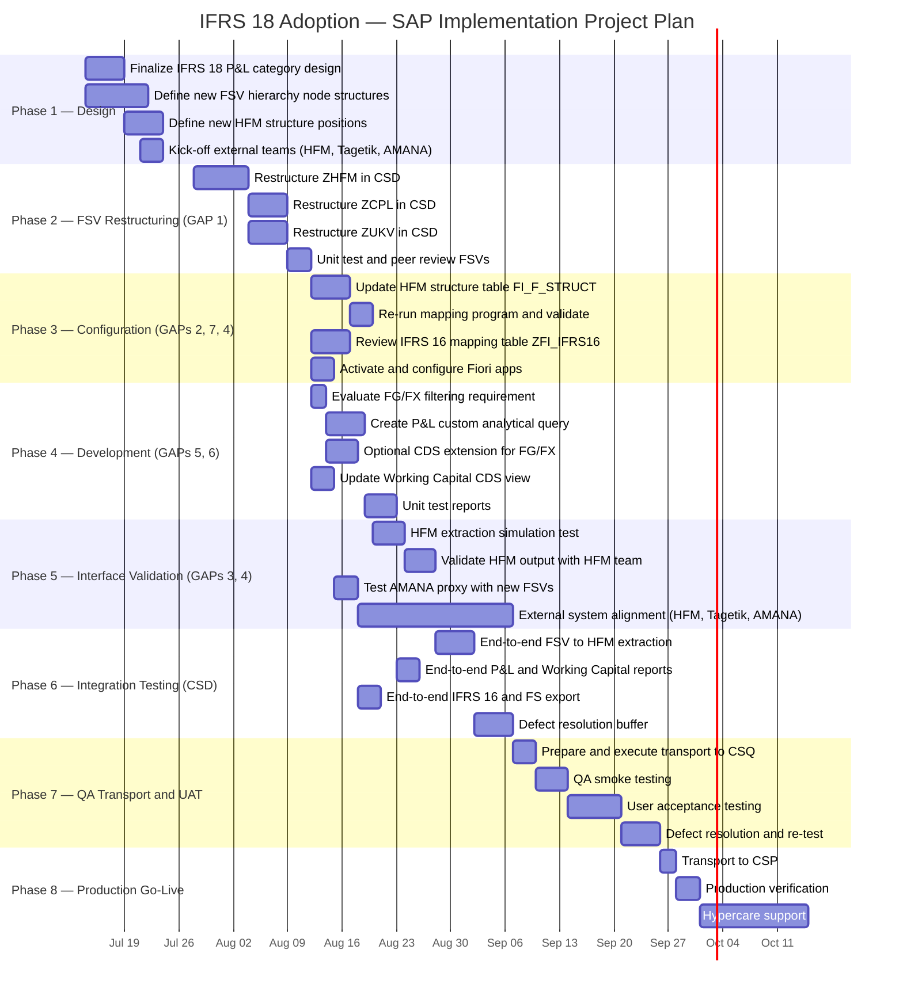

# IFRS 18 Adoption — SAP Implementation Project Plan

Project plan for the IFRS 18 SAP adoption, broken down by phase, activity,
effort, and timeline. Target: production readiness before **January 1,
2027** (IFRS 18 effective date). Plan baseline date: **July 9, 2026**
(~25 weeks of runway); the plan below spans ~22 weeks, leaving buffer
before the effective date.

See [`IFRS18-Fit-Gap-Analysis.md`](IFRS18-Fit-Gap-Analysis.md) for the
underlying GAP definitions this plan implements, and
[`IFRS18_Adoption_Project_Plan.xlsx`](IFRS18_Adoption_Project_Plan.xlsx)
for the editable/trackable version of this plan.

## Visual Timeline (Gantt)

## Detailed Activity Breakdown

### Phase 1 — Design & Preparation (Jul 14 – Jul 25 | 2 weeks)

| # | Activity | GAP | Role | Effort (PD) |
|---|---|---|---|---|
| 1.1 | Finalize IFRS 18 P&L category design with group accounting team (Operating / Investing / Financing boundaries, subtotal definitions) | All | FC + Accounting | 3 |
| 1.2 | Define new FSV hierarchy node structure for ZHFM, ZCPL, ZUKV (node IDs, parent-child relationships, G/L account assignments) | 1 | FC | 5 |
| 1.3 | Define new HFM structure positions and attribute flags (consolidation method, functional area, intercompany, movement type, region, sign reversal) | 2, 3 | FC | 3 |
| 1.4 | Kick-off coordination with HFM team (new structure positions, receiving format) | 3 | FC + HFM | 1 |
| 1.5 | Kick-off coordination with Tagetik team (account code alignment) | 7 | FC + Tagetik | 1 |
| 1.6 | Kick-off coordination with AMANA team (new category handling) | 4 | FC + AMANA | 0.5 |
| | **Phase 1 Subtotal** | | | **13.5** |

### Phase 2 — FSV Restructuring in CSD (Jul 28 – Aug 15 | 3 weeks)

| # | Activity | GAP | Role | Effort (PD) |
|---|---|---|---|---|
| 2.1 | Restructure ZHFM via OB58: add Operating/Investing/Financing nodes, two subtotal nodes, reassign P&L G/L accounts | 1 | FC | 5 |
| 2.2 | Restructure ZCPL via OB58: apply IFRS 18 structure for controlling P&L | 1 | FC | 3 |
| 2.3 | Restructure ZUKV via OB58: apply IFRS 18 categories preserving cost-of-sales classification | 1 | FC | 3 |
| 2.4 | Unit test each FSV using standard financial statement reports (F.01 / RFBILA00) | 1 | FC | 2 |
| 2.5 | Peer review of FSV structures with group accounting | 1 | FC + Accounting | 1 |
| | **Phase 2 Subtotal** | | | **14** |

### Phase 3 — Configuration Updates (Aug 18 – Aug 29 | 2 weeks, parallel tracks)

| # | Activity | GAP | Role | Effort (PD) |
|---|---|---|---|---|
| 3.1 | Update `/FIT/FI_F_STRUCT` table entries via SM30 — add new IFRS 18 P&L structure positions with attribute flags | 2 | FC | 3 |
| 3.2 | Re-execute mapping program `/FIT/FI_D_HFM_BIL_ZUORD_001` (ZHFMB0) with delete-and-regenerate | 2 | FC | 0.5 |
| 3.3 | Validate regenerated `/FIT/FI_F_HKONT` mapping — verify all P&L accounts map to correct new positions, BS mappings intact | 2 | FC | 2 |
| 3.4 | Review all 510 entries in `ZFI_IFRS16` mapping table — verify G/L accounts for depreciation (670xxx → Operating) and interest (661xxx → Financing) are correctly classified in the restructured FSVs | 7 | FC | 2 |
| 3.5 | Update `ZFI_IFRS16` entries if chart of accounts changes or Tagetik introduces new codes | 7 | FC | 1 |
| 3.6 | Activate Fiori apps F0708 and W0161 in Fiori Launchpad | 4 | Basis/FC | 1 |
| 3.7 | Configure Fiori apps for IFRS FSVs (ZHFM, ZCPL, ZUKV) | 4 | FC | 1 |
| | **Phase 3 Subtotal** | | | **10.5** |

### Phase 4 — Development (Aug 18 – Sep 5 | 3 weeks, parallel with Phase 3)

| # | Activity | GAP | Role | Effort (PD) |
|---|---|---|---|---|
| 4.1 | Evaluate whether FG/FX document type exclusion is still a business requirement | 5 | FC + Dev | 1 |
| 4.2 | Create custom analytical query on `I_JournalEntryItemCube` via Custom Analytical Queries app (P&L filter + functional area classification) | 5 | FC/Dev | 3 |
| 4.3 | *Optional:* Create CDS view extension on `I_JournalEntryItemCube` for FG/FX filtering (if required) | 5 | Dev | 2 |
| 4.4 | Update `ZI_GLAcctBalanceCube` CASE WHEN statement — replace hardcoded ZHFM hierarchy node IDs with new node IDs from restructured hierarchy | 6 | Dev | 1 |
| 4.5 | Verify `ZC_WORKINGCAPITAL_Q001` downstream — confirm hierarchy filter binding still valid | 6 | Dev | 0.5 |
| 4.6 | Evaluate SAC prototype views (`ZP_WORKINGCAPITAL_ITEM` etc.) for retirement | 6 | Dev | 0.5 |
| 4.7 | Unit test new P&L analytical query — compare output with `ZC_PROFITANDLOSS_UKV` for reference period | 5 | FC | 2 |
| 4.8 | Unit test working capital report — validate all 5 categories produce correct balances | 6 | FC | 1 |
| | **Phase 4 Subtotal** | | | **11** |

### Phase 5 — Interface Validation (Sep 1 – Sep 19 | 3 weeks)

| # | Activity | GAP | Role | Effort (PD) |
|---|---|---|---|---|
| 5.1 | Run HFM extraction in simulation mode (`PX_SIMUL = 'X'`) via ZHFM01 | 3 | FC | 1 |
| 5.2 | Validate HFM output file format against HFM expected input — verify new structure positions appear correctly in aggregation pipeline (INTF1→4) | 3 | FC + HFM | 2 |
| 5.3 | Verify `/FIT/FI_F_KONSM` and `/FIT/FI_F_RMVCT` entries are correct for new positions | 3 | FC | 1 |
| 5.4 | Test AMANA proxy parsing with restructured FSV output — verify positional parsing still works | 4 | FC | 1 |
| 5.5 | Coordinate HFM-side configuration updates (new accounts/categories in HFM) | 3 | HFM team | 3 |
| 5.6 | Coordinate Tagetik account code alignment | 7 | Tagetik team | 2 |
| 5.7 | Coordinate AMANA receiving system updates | 4 | AMANA team | 1 |
| | **Phase 5 Subtotal** | | | **11** |

### Phase 6 — Integration Testing in CSD (Sep 15 – Oct 10 | 3.5 weeks)

| # | Activity | GAP | Role | Effort (PD) |
|---|---|---|---|---|
| 6.1 | End-to-end: FSV → mapping regeneration → HFM extraction → file validation | 1→2→3 | FC | 3 |
| 6.2 | End-to-end: FSV → P&L report with IFRS 18 categories and subtotals | 1→5 | FC | 1 |
| 6.3 | End-to-end: FSV → working capital report with updated hierarchy nodes | 1→6 | FC | 1 |
| 6.4 | End-to-end: IFRS 16 lease posting → verify FSV classification (depreciation = Operating, interest = Financing) | 1→7 | FC | 1 |
| 6.5 | End-to-end: Financial statement export → AMANA transfer | 1→4 | FC | 1 |
| 6.6 | Regression test: Shareholder reporting (FIT — no changes expected) | — | FC | 0.5 |
| 6.7 | Compare pre-IFRS 18 (XHFM/XCPL/XUKV) vs. post-IFRS 18 output for audit trail | All | FC | 2 |
| 6.8 | Defect resolution buffer | All | FC + Dev | 3 |
| | **Phase 6 Subtotal** | | | **12.5** |

### Phase 7 — QA Transport & UAT (Oct 13 – Nov 7 | 4 weeks)

| # | Activity | GAP | Role | Effort (PD) |
|---|---|---|---|---|
| 7.1 | Prepare transport requests (config + workbench) | All | Dev/Basis | 1 |
| 7.2 | Execute transport CSD → CSQ | All | Basis | 0.5 |
| 7.3 | QA smoke testing — verify all 7 capabilities in CSQ | All | FC | 3 |
| 7.4 | User acceptance testing with business users (finance, controlling, consolidation) | All | Business + FC | 5 |
| 7.5 | Defect resolution and re-transport | All | FC + Dev | 3 |
| 7.6 | Re-test after fixes | All | FC | 2 |
| | **Phase 7 Subtotal** | | | **14.5** |

### Phase 8 — Production Go-Live (Nov 10 – Dec 5 | 4 weeks incl. hypercare)

| # | Activity | GAP | Role | Effort (PD) |
|---|---|---|---|---|
| 8.1 | Execute transport CSQ → CSP | All | Basis | 0.5 |
| 8.2 | Production verification — run each capability and validate output | All | FC | 2 |
| 8.3 | Go-live communication to business users | All | PM | 0.5 |
| 8.4 | Hypercare support (2 weeks — monitor HFM extraction, reports, IFRS 16 postings) | All | FC + Dev | 5 |
| | **Phase 8 Subtotal** | | | **8** |

Note: Phases 3 and 4 run in parallel, and Phase 5 overlaps with the tail
end of Phase 4, so the calendar duration is shorter than the sum of
individual phase durations.

## Effort Summary

### By Phase

| Phase | Duration | Effort (PD) |
|---|---|---|
| 1. Design & Preparation | 2 weeks | 13.5 |
| 2. FSV Restructuring | 3 weeks | 14.0 |
| 3. Configuration Updates | 2 weeks | 10.5 |
| 4. Development | 3 weeks | 11.0 |
| 5. Interface Validation | 3 weeks | 11.0 |
| 6. Integration Testing | 3.5 weeks | 12.5 |
| 7. QA Transport & UAT | 4 weeks | 14.5 |
| 8. Production Go-Live | 4 weeks | 8.0 |
| **Total** | **~22 weeks** | **~95 person-days** |

### By Role

| Role | Effort (PD) | % of Total |
|---|---|---|
| FI/CO Functional Consultant | 65 | 68% |
| ABAP Developer | 12 | 13% |
| Business Users (UAT) | 5 | 5% |
| Project Manager | 5 | 5% |
| External Teams (HFM, Tagetik, AMANA) | 6 | 6% |
| SAP Basis Administrator | 3 | 3% |
| **Total** | **~96** | **100%** |

### By GAP

| GAP | Type | Effort (PD) | Notes |
|---|---|---|---|
| 1. IFRS Financial Statement Structure Definition | CONFIG | 19 | Largest single item — 3 FSVs to restructure |
| 2. G/L Account to Consolidation Structure Mapping | CONFIG | 9 | Table updates + mapping regeneration |
| 3. Financial Data Extraction for Group Consolidation | INTERFACE + CONFIG | 10 | Includes HFM-side coordination |
| 4. Financial Statement Data Export | INTERFACE | 7 | Fiori activation + AMANA testing |
| 5. Income Statement Reporting (Cost of Sales) | REPORT | 9 | New analytical query + optional CDS extension |
| 6. Working Capital Balance Sheet Reporting | ENHANCEMENT | 5 | CDS view node ID update |
| 7. IFRS 16 Lease Accounting Data Loading | CONFIG | 6 | Mapping table review + Tagetik coordination |
| Cross-cutting (PM, defect resolution, transports, UAT, hypercare) | — | 30 | Shared across all GAPs |
| **Total** | | **~95** | |

### By Work Type

| Category | Effort (PD) | % of Total |
|---|---|---|
| Configuration / Customizing (OB58, SM30, table maintenance) | 30 | 32% |
| Development (CDS views, analytical queries) | 8 | 8% |
| Testing (unit, integration, QA, UAT) | 27 | 28% |
| External Coordination (HFM, Tagetik, AMANA) | 8 | 8% |
| Project Management & Go-Live | 14 | 15% |
| Defect Resolution Buffer | 8 | 9% |
| **Total** | **~95** | **100%** |

**Notes:**

- **68% of the effort is functional consultant work** — this is a
  configuration-heavy project, not a development-heavy one. Only GAPs 5
  and 6 require developer involvement, and even GAP 6 is a small CDS
  view update.
- **The critical path** runs through GAP 1 → GAP 2 → GAP 3 → Integration
  Testing → UAT → Go-Live. Any delay in the FSV restructuring cascades to
  everything downstream.
- **External team dependencies** (HFM, Tagetik, AMANA) account for only 6
  person-days of SAP-side coordination effort, but the external teams'
  own work is outside this estimate and represents the biggest schedule
  risk.
- **The 8 PD defect resolution buffer** (~9%) is conservative. If the FSV
  design is well-defined upfront in Phase 1, defects should be minimal
  since most changes are configuration-driven.
- **The optional FG/FX CDS extension** (GAP 5, activity 4.3) adds 2 PD if
  the business decides the foreign currency valuation exclusion is still
  required. This is already included in the estimate.

## Key Milestones

| Date | Milestone |
|---|---|
| Jul 25 | Design complete — FSV node structures and HFM positions defined |
| Aug 15 | FSV restructuring complete in CSD (ZHFM, ZCPL, ZUKV) |
| Sep 5 | All configuration and development complete in CSD |
| Sep 19 | Interface validation complete (HFM, AMANA) |
| Oct 10 | Integration testing complete — all defects resolved |
| Oct 13 | Transport to CSQ |
| Nov 7 | UAT sign-off |
| Nov 10 | Transport to CSP (Production) |
| Nov 14 | Go-live verification complete |
| Dec 5 | Hypercare ends |
| Jan 1, 2027 | IFRS 18 effective — system fully operational |

## Risks and Assumptions

### Risks

| Risk | Impact | Mitigation |
|---|---|---|
| HFM-side changes delayed (external team dependency) | Blocks end-to-end validation of consolidation interface | Early kick-off in Phase 1; parallel workstream with HFM team starting Aug 18 |
| Tagetik introduces new account codes for IFRS 18 | Additional mapping table entries needed in ZFI_IFRS16 | Coordinate with Tagetik team in Phase 1; buffer in Phase 3 |
| FG/FX filtering required for P&L report | Adds CDS view extension development (2 extra PD) | Business decision in Phase 4 activity 4.1; effort already included as optional |
| ZHFM hierarchy node IDs change more extensively than expected | More CDS view updates needed in working capital report | Detailed node mapping in Phase 1 activity 1.2 identifies all affected nodes upfront |
| Transport conflicts in CSQ/CSP | Delays go-live | Dedicated transport request preparation; coordinate with other project teams |

### Assumptions

- The FSV restructuring design (which G/L accounts go into which IFRS 18
  category) has been agreed upon by group accounting — if not, Phase 1
  may need to be extended.
- The CSD development system is available for configuration and
  development throughout the project period.
- No other major transports to CSQ/CSP are planned that would conflict
  with this project's transport window.
- The HFM, Tagetik, and AMANA teams have capacity to support their
  respective workstreams within the timeline.
- The pre-IFRS 18 backup FSVs (XHFM, XCPL, XUKV) remain untouched for
  comparison and audit purposes.
